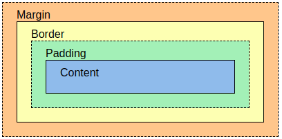

# Uppsetning HTML vefsíðu 

Þú getur notað textann [verkefni-1-texti](verkefni-1-texti.md) í uppsetningu vefsíðunnar.

```HTML

<!DOCTYPE html><!-- Nýasta útgáfa HTML. Ef yfilýsingin er ekki tekin fram notar vafrinn 4. útgáfuna -->
<html lang="is">
<head>
    <meta charset="UTF-8">
    <meta http-equiv="X-UA-Compatible" content="IE=edge">
    <meta name="viewport" content="width=device-width, initial-scale=1.0">
    <title>Document</title>
</head>
<body>
    <!-- Hér kemur efni sem birtist í vafra (browser) -->
</body>
</html>

``` 

Mundu að eftirfarandi þarf ávallt að vera til staðar í HTML skjali:

-   **\<!DOCTYPE HTML\>** tilgreinir hvaða útgáfu af HTML staðli vafrinn
    á að nota, þetta er HTML 5 skilgreining.

-   **\<html skipunum\>** á alltaf að loka með **\</\...\>** og enda
    skjalið **\</body\>\</html\>** undantekningar eru nokkrar t.a.m. **\<meta\>, \,\<br\>, \<hr\> og \<input\>**

-   Vistið skjalið með endingunni **.html** til að hægt sé að opna það í
    vafra (browser).

-   Það má **EKKI hafa** **íslenska stafi** í heiti skjalsins eða hafa
    **stafabil** í heitinu.

-   Þú skoðar html síðuna í vafra með því að smella á html skjalið þar
    sem þú vistaðir það.

________________________________________________________

# CSS stílsetning


Valtag (_selector_) bendir á HTML þáttinn (_element_) sem þú vilt stíla.

Hver skipun inniheldur eigindi og gildi.

Valtagið inniheldur eina eða fleiri skipanir sem eru aðgreindar með semikommum.

Margar CSS skipanir eru aðgreindar með semikommum og þær eru umvafðar með slaufusviga.

Dæmi:

```CSS

.header h1 {
    color: #fff;
    line-height: 1.2;
    font-weight: normal;
}

```

#### Stílsíða tengd við HTML vefsíðu

```HTML
    <!--link er í head taginu -->
    <link rel="stylesheet" type="text/css" href="styles.css">

```
#### Vefsíður tengdar saman \<a\> 

```HTML
    <a href="sida2.html" title="Síða 2">Síða 2</a>
```
#### Anchor Pseudo-classes \<a\>

```CSS
    /* unvisited link */
    a:link {
        color: #FF0000;
    }

    /* visited link */
    a:visited {
        color: #00FF00;
    }

    /* mouse over link */
    a:hover {
        color: #FF00FF;
    }

    /* selected link */
    a:active {
        color: #0000FF;
    }
```

[Sjá nánar á w3schools](https://www.w3schools.com/css/css_pseudo_classes.asp)

#### Gildum hlaðið á eigindi 

```CSS

div {
	margin: 10px 20px 30px 40px; 
	   /*-top(1) -right(2) -bottom(3) -left(4) 
	   á bæði við margin og padding */
	
	padding: 10px 20px; 
		/*top+bottom og left+right 
		á bæði við margin og padding */
	
	border: 5px solid #f0f; 
	        /*-weight, -style, -color */
	/* 7 gildi eru í border-style: solid, dotted, dashed, double, ridge, inset, outset,*/
	/*ath! að veja aðeins eitt gildi á border-style:*/
}

```

## Box Modelið



Explanation of the different parts:

- Content - The content of the box, where text and images appear
- Padding - Clears an area around the content. The padding is transparent
- Border - A border that goes around the padding and content
- Margin - Clears an area outside the border. The margin is transparent

The box model allows us to add a border around elements, and to define space between elements. 

# Display

## Block-level Elements

A block-level element always starts on a new line and takes up the full width available (stretches out to the left and right as far as it can).

The &lt;div> element is a block-level element.
Examples of block-level elements:

```HTML
<div>
<h1> - <h6>
<p>
<form>
<header>
<footer>
<section>
```

## Inline Elements
An inline element does not start on a new line and only takes up as much width as necessary.

This is an inline &lt;span> element inside a paragraph.

Examples of inline elements:

```HTML

<span>
<a>


```

## Display: none;

display: none; is commonly used with JavaScript to hide and show elements without deleting and recreating them. Take a look at our last example on this page if you want to know how this can be achieved.

The &lt;script> element uses display: none; as default. 

# The float Property

The float property is used for positioning and formatting content e.g. let an image float left to the text in a container.

The float property can have one of the following values:

- left - The element floats to the left of its container
- right - The element floats to the right of its container
- none - The element does not float (will be displayed just where it occurs in the text). This is default
- inherit - The element inherits the float value of its parent

In its simplest use, the float property can be used to wrap text around images.

# Flexbox

[W3Schools Flexbox](https://www.w3schools.com/css/css3_flexbox.asp)